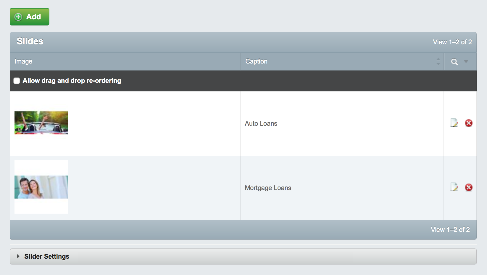

# SilverStripe FlexSlider

Display FlexSlider slide shows on your SilverStripe website.

## Getting started

### Configuration

In your `mysite/_config/config.yml` add the following to the desired page type or DataObject you wish to add the FlexSlider to:

```
Page:
  extensions:
    - FlexSlider
```

Alternatively you could add the following to your `mysite/_config.php` file:

```
Page::add_extension('FlexSlider'); 
```

After attaching the DataExtension to your page type or DataObject run a `dev/build` then `?flush=all`. 

This module uses [ImageUploadField](https://github.com/dynamic/silverstripe-imageuploadfield/) for the slide image field. See the [docs](https://github.com/dynamic/silverstripe-imageuploadfield/blob/master/docs/en/index.md) for configuration options such as changing the max upload limit.

### User Guide

You should now see a "Slides" tab on the page type or DataObject to which you applied the DataExtension. Simply create Slides to be included in the slide show that link to other pages on your website.



You can inculde FlexSlider in your layout by using `<% include FlexSlider %>`

